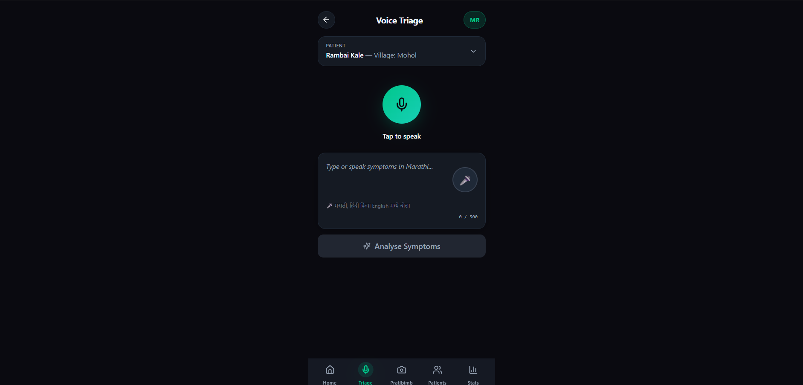
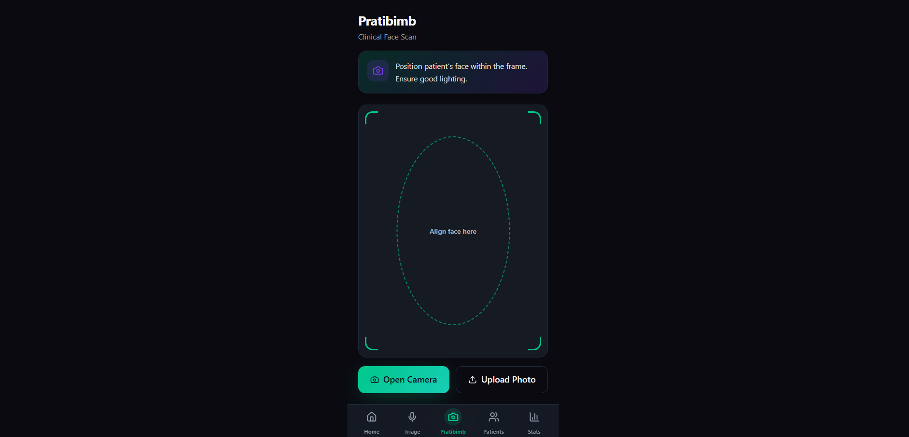
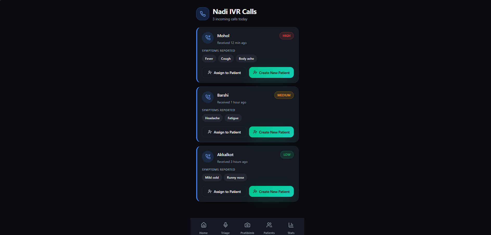
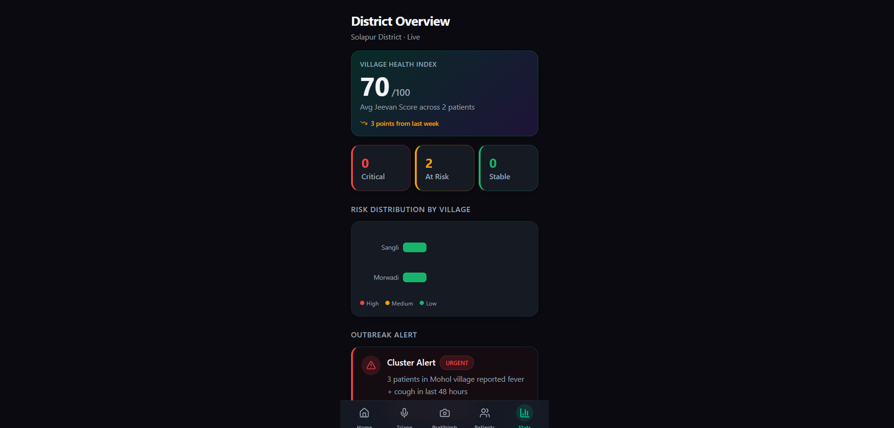
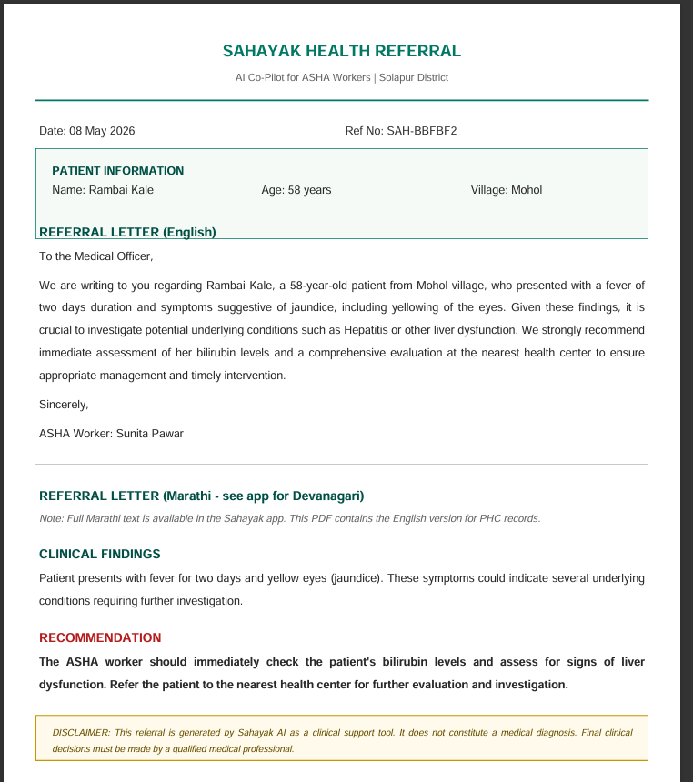
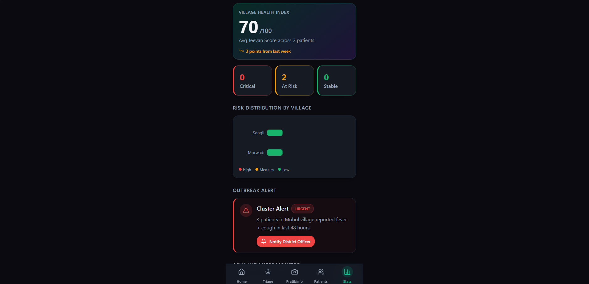
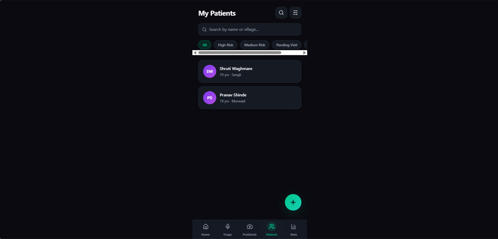

<p align="center">
  
</p>

<h1 align="center">Sahayak Health 🏥</h1>

<p align="center">
  <strong>AI Co-Pilot for ASHA Workers in Rural India</strong><br/>
  Powered by <a href="https://ai.google.dev/gemma">Gemma 4</a> — Runs Fully Offline
</p>

<p align="center">
  
  
  
  
  
</p>

---

## 📋 Table of Contents

- [The Problem](#-the-problem)
- [What is Sahayak?](#-what-is-sahayak)
- [Core Modules](#-core-modules)
- [Supporting Features](#-supporting-features)
- [Screenshots](#-screenshots)
- [Architecture](#-architecture)
- [Tech Stack](#-tech-stack)
- [Project Structure](#-project-structure)
- [Getting Started](#-getting-started)
- [API Reference](#-api-reference)
- [Knowledge Base (RAG)](#-knowledge-base-rag)
- [Why Gemma 4?](#-why-gemma-4)
- [Roadmap](#-roadmap)
- [Team](#-team)
- [License](#-license)

---

## 🚨 The Problem

India's rural healthcare is in crisis:

| Statistic | Reality |
|-----------|---------|
| **600M+** | Indians in villages with **no doctor nearby** |
| **1M+** | ASHA workers are the **only healthcare touchpoint** |
| **Zero** | Diagnostic tools available to them |
| **Keypad phones** | Majority have **no smartphone** |
| **Paper-based** | All records are manual, **Marathi-only** |

ASHA (Accredited Social Health Activist) workers are the lifeline of rural Indian healthcare. They serve populations of 1,000+ each, conducting home visits for maternal care, immunization, and disease surveillance — but with **no AI tools, no diagnostic support, and no digital infrastructure**.

---

## 💡 What is Sahayak?

**Sahayak** (सहायक — meaning "helper" in Marathi) is an AI-powered health screening co-pilot built specifically for ASHA workers in rural Maharashtra.

It runs **100% offline** using **Google's Gemma 4 (gemma3:4b)** via Ollama — no internet, no cloud API, no data leaving the device. This is critical because rural India has **unreliable connectivity**.

> ⚠️ **Important**: Sahayak is a **screening tool**, not a diagnostic system. It flags health risks and recommends referrals. Final clinical decisions are always made by qualified medical professionals at PHCs (Primary Health Centers).

---

## 🧩 Core Modules

### 1. 🗣️ Voice Triage
> *Speak symptoms in Marathi → AI returns severity + referral decision*

- Accepts symptom descriptions in **Marathi, Hindi, or English**
- Returns structured risk assessment with severity levels (`low` / `medium` / `high` / `emergency`)
- Identifies red flags and recommends specific ASHA actions
- Includes bilingual response (English + Marathi/Devanagari)

<!-- SCREENSHOT: Voice Triage page -->
<p align="center">
  
  <br/><em>Voice Triage — Marathi symptom input with AI risk assessment</em>
</p>

---

### 2. 📸 Pratibimb (Face Scan)
> *10-second face photo → detects anemia, jaundice, dehydration via camera*

- Captures facial image and analyzes for visible clinical signs
- Screens for: **Anemia** (pale conjunctiva), **Jaundice** (yellow sclera), **Dehydration** (sunken eyes), **Respiratory distress** (nostril flaring)
- Returns confidence scores and referral recommendations
- Works with any basic camera — no special hardware needed

<!-- SCREENSHOT: Pratibimb Face Scan page -->
<p align="center">
  
  <br/><em>Pratibimb — AI visual screening for anemia, jaundice & dehydration</em>
</p>

---

### 3. 📞 Nadi (Voice Agent & IVR Triage)
> *Real-time voice agent & Toll-free IVR → Natural Marathi voice interactions → works on any keypad phone*

- **Real-time Voice Agent** powered by **ElevenLabs** for natural, human-like conversational triage
- Designed for patients with **no smartphone** — works on basic keypad phones
- AI-driven dynamic health assessment in **Marathi Voice**
- Collects: age group, symptoms, duration, fever, breathing, pregnancy, chronic conditions
- Real-time transcription, status tracking, and audio visualizer for ASHA workers
- Integrates with **ElevenLabs** for voice AI and **Twilio** for telephony

<!-- SCREENSHOT: Nadi IVR page -->
<p align="center">
  
  <br/><em>Nadi — Toll-free IVR health triage for feature phones</em>
</p>

---

## 🔧 Supporting Features

### 📊 Jeevan Score (Health Trajectory)
A **0–100 health score** calculated from a patient's screening history:

| Score Range | Status | Meaning |
|------------|--------|---------|
| 75–100 | 🟢 Stable | Healthy trajectory |
| 60–74 | 🟡 At Risk | Needs monitoring |
| 0–59 | 🔴 Critical | Immediate attention |

The score factors in: red flags, emergency events, referral frequency, improving trends, and recent visit activity.

<!-- SCREENSHOT: Jeevan Score display -->
<p align="center">
  
  <br/><em>Jeevan Score — Patient health trajectory tracking</em>
</p>

---

### 📄 Auto Marathi PDF Referral Letter
- AI generates a **formal bilingual referral letter** (English + Marathi)
- Auto-populated with patient details, clinical findings, and recommendations
- Downloadable PDF with **Sahayak branding** and medical disclaimer
- Ready to hand to PHC doctor — no handwriting required

<!-- SCREENSHOT: Referral Letter generation -->
<p align="center">
  
  <br/><em>Auto-generated bilingual referral letter for PHC</em>
</p>

---

### 🧠 ASHA Burnout Detection
- Extracts wellness signals from session notes: **sleep, fatigue, mood, appetite, stress**
- Flags burnout patterns (constant exhaustion, hopelessness, missed visits)
- Proactive alert: *"Poor sleep detected 4 days in a row"*
- Because **ASHA workers' health matters too**

---

### 🗺️ District Dashboard & Outbreak Heatmap
- Aggregate view of all patients across villages
- Village-level risk distribution (high/medium/low)
- Average Jeevan Score across the district
- Identifies potential **outbreak clusters**

<!-- SCREENSHOT: District Dashboard -->
<p align="center">
  
  <br/><em>District Dashboard — Village risk heatmap and outbreak monitoring</em>
</p>

---

### 👥 Patient Management
- Register patients with name, age, village, phone, conditions
- View complete patient history with all screening sessions
- Track Jeevan Score trajectory over time

<!-- SCREENSHOT: Patient Management -->
<p align="center">
  
  <br/><em>Patient registry with health history tracking</em>
</p>

---

## 📸 Screenshots

> **Add your screenshots here.** Place image files in `docs/screenshots/` and update the paths below.

| Screen | Screenshot |
|--------|-----------|
| **Home / Dashboard** | `docs/screenshots/home.png` |
| **Voice Triage** | `docs/screenshots/triage.png` |
| **Triage Results** | `docs/screenshots/triage_result.png` |
| **Pratibimb Face Scan** | `docs/screenshots/pratibimb.png` |
| **Pratibimb Results** | `docs/screenshots/pratibimb_result.png` |
| **Nadi IVR** | `docs/screenshots/nadi.png` |
| **Patient List** | `docs/screenshots/patients.png` |
| **Patient Detail** | `docs/screenshots/patient_detail.png` |
| **Jeevan Score** | `docs/screenshots/jeevan_score.png` |
| **Referral Letter** | `docs/screenshots/referral.png` |
| **District Dashboard** | `docs/screenshots/dashboard.png` |
| **ASHA Wellness Alert** | `docs/screenshots/wellness_alert.png` |

---

## 🏗️ Architecture

```
┌─────────────────────────────────────────────────────────┐
│                    ASHA Worker Device                     │
│  ┌─────────────────────────────────────────────────┐     │
│  │         React Frontend (Vite + ShadcnUI)         │     │
│  │   Triage │ Pratibimb │ Nadi │ Dashboard │ Patients│    │
│  └───────────────────┬─────────────────────────────┘     │
│                      │ HTTP/REST                         │
│  ┌───────────────────▼─────────────────────────────┐     │
│  │            FastAPI Backend (Python)               │     │
│  │  ┌──────────┐ ┌──────────┐ ┌──────────────────┐  │     │
│  │  │ Gemma 4  │ │ RAG/KB   │ │ SQLite Database  │  │     │
│  │  │ Client   │ │ Engine   │ │ (Patients/Sessions│  │     │
│  │  └────┬─────┘ └────┬─────┘ └──────────────────┘  │     │
│  │       │             │                              │     │
│  │  ┌────▼─────────────▼─────┐                       │     │
│  │  │  Knowledge Base (RAG)   │                       │     │
│  │  │  asha_protocols.txt     │                       │     │
│  │  │  rural_diseases.txt     │                       │     │
│  │  └────────────────────────┘                       │     │
│  └───────────────────┬─────────────────────────────┘     │
│                      │ localhost:11434                    │
│  ┌───────────────────▼─────────────────────────────┐     │
│  │          Ollama (Local LLM Runtime)               │     │
│  │          Model: gemma3:4b (3GB VRAM)              │     │
│  │          100% Offline · Zero Cloud Calls           │     │
│  └─────────────────────────────────────────────────┘     │
└─────────────────────────────────────────────────────────┘
                    
         📞 Keypad Phone Users
              │
              ▼
    ┌──────────────────┐
    │   Twilio IVR &   │
    │   ElevenLabs AI  │
    │   (Nadi Module)  │
    │   Marathi Voice  │
    └──────────────────┘
```

---

## 🛠️ Tech Stack

| Layer | Technology | Purpose |
|-------|-----------|---------|
| **AI Model** | Gemma 4 (`gemma3:4b`) | Local LLM inference — runs fully offline |
| **LLM Runtime** | Ollama | Manages and serves Gemma 4 locally |
| **RAG** | Keyword-based retrieval | ASHA protocols & disease knowledge fed as context |
| **Backend** | FastAPI (Python) | REST API, routing, business logic |
| **Database** | SQLite | Patient records, sessions, Nadi calls |
| **Frontend** | React 18 + Vite + TypeScript | Mobile-first responsive UI |
| **UI Components** | ShadcnUI + Radix + Tailwind CSS | Accessible, modern component library |
| **Animations** | Framer Motion | Page transitions and micro-interactions |
| **Charts** | Recharts | Dashboard data visualization |
| **PDF Generation** | fpdf2 | Bilingual referral letter PDFs |
| **Voice AI Agent** | ElevenLabs | Real-time human-like Marathi voice conversations for Nadi |
| **IVR/Telephony** | Twilio | Nadi module for keypad phone users |

---

## 📂 Project Structure

```
Sahayak Healthcare/
├── backend/
│   ├── main.py                 # FastAPI app — all API routes
│   ├── gemma_client.py         # Gemma 4 AI client (replaces Gemini)
│   ├── database.py             # SQLite — patients, sessions, nadi_calls
│   ├── jeevan_score.py         # 0-100 health trajectory calculator
│   ├── pdf_gen.py              # Bilingual referral PDF generator
│   ├── requirements.txt        # Python dependencies
│   ├── sahayak.db              # SQLite database file
│   ├── .env                    # Environment config (Gemma model, Ollama host)
│   └── knowledge_base/         # RAG knowledge files
│       ├── asha_protocols.txt  # ASHA health protocols & screening guides
│       └── rural_diseases.txt  # Common rural disease reference
│
├── Frontend/
│   ├── src/
│   │   ├── pages/
│   │   │   ├── Index.tsx       # Home — quick actions & alerts
│   │   │   ├── Triage.tsx      # Voice triage input & results
│   │   │   ├── Pratibimb.tsx   # Face scan camera & analysis
│   │   │   ├── Nadi.tsx        # IVR call logs & status
│   │   │   ├── Patients.tsx    # Patient registry & search
│   │   │   ├── PatientDetail.tsx # Individual patient history
│   │   │   ├── Referral.tsx    # Referral letter generation
│   │   │   ├── Dashboard.tsx   # District-level analytics
│   │   │   └── NotFound.tsx    # 404 page
│   │   ├── lib/
│   │   │   └── api.ts          # API client — all backend calls
│   │   ├── components/         # Reusable UI components
│   │   ├── App.tsx             # Route definitions
│   │   └── main.tsx            # Entry point
│   ├── package.json
│   └── vite.config.ts
│
├── docs/
│   └── screenshots/            # Project screenshots (add here)
│
└── README.md                   # This file
```

---

## 🚀 Getting Started

### Prerequisites

| Requirement | Version | Notes |
|-------------|---------|-------|
| Python | 3.10+ | Backend runtime |
| Node.js | 18+ | Frontend build |
| Ollama | Latest | Local LLM runtime |
| Gemma 4 model | `gemma3:4b` | ~3GB download |

### 1. Clone the Repository

```bash
git clone https://github.com/pranavshinde369/sahayak-health.git
cd sahayak-health
```

### 2. Setup Ollama + Gemma 4

```bash
# Install Ollama (https://ollama.com/download)
# Then pull the Gemma 4 model:
ollama pull gemma3:4b

# Start Ollama server:
ollama serve
```

### 3. Start the Backend

```bash
cd backend

# Create virtual environment
python -m venv venv
# Windows:
.\venv\Scripts\activate
# Linux/Mac:
source venv/bin/activate

# Install dependencies
pip install -r requirements.txt

# Start FastAPI server
uvicorn main:app --reload --port 8000
```

The backend will be running at `http://localhost:8000`

### 4. Start the Frontend

```bash
cd Frontend

# Install dependencies
npm install

# Start dev server
npm run dev
```

The frontend will be running at `http://localhost:8080`

### 5. Verify Everything Works

```bash
# Health check
curl http://localhost:8000/

# Test triage with Marathi input
curl -X POST http://localhost:8000/api/triage \
  -H "Content-Type: application/json" \
  -d '{"text":"रुग्णाला ताप आहे डोळे पिवळे आहेत","language":"mr"}'
```

---

## 📡 API Reference

| Method | Endpoint | Description |
|--------|----------|-------------|
| `GET` | `/` | Health check |
| `POST` | `/api/triage` | Voice triage — symptom text → risk assessment |
| `POST` | `/api/pratibimb` | Face scan — base64 image → clinical signs |
| `POST` | `/api/wellness/extract` | Extract ASHA wellness/burnout signals |
| `POST` | `/api/referral/generate` | Generate bilingual referral letter + PDF |
| `GET` | `/api/referral/download/{filename}` | Download referral PDF |
| `GET` | `/api/jeevan/{patient_id}` | Get Jeevan Score for patient |
| `POST` | `/api/patients` | Register new patient |
| `GET` | `/api/patients` | List all patients |
| `GET` | `/api/patients/{patient_id}` | Get patient details + history |
| `GET` | `/api/elevenlabs/token` | Get signed URL for ElevenLabs voice session |
| `POST` | `/api/nadi/webhook` | Twilio IVR webhook for Nadi |
| `POST` | `/api/nadi/process` | Process Nadi IVR transcript |
| `GET` | `/api/nadi/calls` | List all Nadi IVR calls |
| `GET` | `/api/dashboard` | District dashboard analytics |

### Example: Triage Request

```json
// POST /api/triage
{
  "text": "रुग्णाला ताप आहे डोळे पिवळे आहेत",
  "language": "mr",
  "patient_id": "abc123"
}
```

### Example: Triage Response

```json
{
  "assessment": "Patient presents with fever and yellow eyes suggesting possible jaundice",
  "assessment_mr": "रुग्णाला ताप आणि पिवळे डोळे आहेत, कावीळ होण्याची शक्यता",
  "risk_level": "high",
  "red_flags": ["yellow eyes", "fever"],
  "recommendation": "Refer to PHC immediately for liver function tests",
  "recommendation_mr": "तात्काळ PHC मध्ये पाठवा",
  "referral_needed": true,
  "refer_urgency": "immediate"
}
```

---

## 📚 Knowledge Base (RAG)

Sahayak uses a lightweight **Retrieval-Augmented Generation** system to ground Gemma 4's responses in verified ASHA protocols:

### How It Works

1. **Knowledge Files** — Plain text files in `backend/knowledge_base/`
2. **Chunking** — Files are split into sections by double newline
3. **Keyword Matching** — Query words are matched against chunks (no vector DB needed)
4. **Top-K Selection** — Best 3 matching chunks injected into the prompt
5. **Grounded Response** — Gemma 4 uses protocol context for accurate screening

### Knowledge Sources

| File | Content | Sections |
|------|---------|----------|
| `asha_protocols.txt` | Official ASHA health protocols | Danger signs, Anemia, Jaundice, Malaria, Maternal health, Child health, Dehydration, TB, Burnout |
| `rural_diseases.txt` | Common rural disease reference | Dengue, Typhoid, Pneumonia, Hepatitis, Anemia, Malnutrition, Hypertension, Diabetes |

> **Why not ChromaDB/vector DB?** ASHA workers' devices have 8GB RAM or less. Keyword matching is lightweight, fast, and sufficient for our structured knowledge base. No GPU needed.

---

## 🤖 Why Gemma 4?

| Feature | Why It Matters for Sahayak |
|---------|---------------------------|
| **Runs locally via Ollama** | No internet needed — perfect for rural India with zero connectivity |
| **4B parameters** | Fits in 8GB RAM on CPU — runs on affordable hardware |
| **Multilingual** | Understands Marathi, Hindi, and English natively |
| **JSON mode** | Structured output for consistent API responses |
| **Vision capable** | Pratibimb face scan uses multimodal capabilities |
| **Open source** | No API costs, no data privacy concerns, fully auditable |
| **Google DeepMind** | State-of-the-art quality at small model size |

### Performance on i5-8250U (8GB RAM, CPU-only)

| Metric | Value |
|--------|-------|
| First inference | ~90-120s (model loading) |
| Subsequent calls | ~30-60s |
| Memory usage | ~4GB |
| Context window | 2048 tokens |

> For production deployment on better hardware (e.g., Raspberry Pi 5 with 8GB or a mid-range phone), inference time drops to **10-20 seconds**.

---

## 🗺️ Roadmap

- [x] Voice Triage (Marathi/Hindi/English)
- [x] Pratibimb Face Scan (Anemia, Jaundice, Dehydration)
- [x] Nadi Voice Agent & IVR (ElevenLabs + Twilio)
- [x] Jeevan Score (0-100 health trajectory)
- [x] Auto Marathi PDF Referral Letters
- [x] ASHA Burnout Detection
- [x] District Dashboard & Heatmap
- [x] RAG with ASHA Protocols
- [x] Gemma 4 Local Inference (fully offline)
- [ ] React Native mobile app for ASHA workers
- [ ] Offline-first PWA with sync-when-connected
- [ ] MUAC measurement via camera (malnutrition screening)
- [ ] Integration with HMIS (Health Management Information System)
- [ ] Multi-district deployment
- [ ] Marathi voice input (speech-to-text)
- [ ] ASHA training module with AI quizzes

---

## 👥 Team

| Name | Role | GitHub |
|------|------|--------|
| **Pranav Shinde** | Full-Stack Developer & AI Engineer | [@pranavshinde369](https://github.com/pranavshinde369) |

---

## 📄 License

This project is licensed under the **MIT License** — see the [LICENSE](LICENSE) file for details.

---

<p align="center">
  <strong>Built with ❤️ for India's rural healthcare heroes</strong><br/>
  <em>सहायक — Because every ASHA worker deserves an AI co-pilot</em>
</p>

---

<p align="center">
  <sub>Disclaimer: Sahayak is a screening tool, not a diagnostic system. It flags health risks for review by qualified medical professionals. Never use it as a substitute for clinical diagnosis.</sub>
</p>
